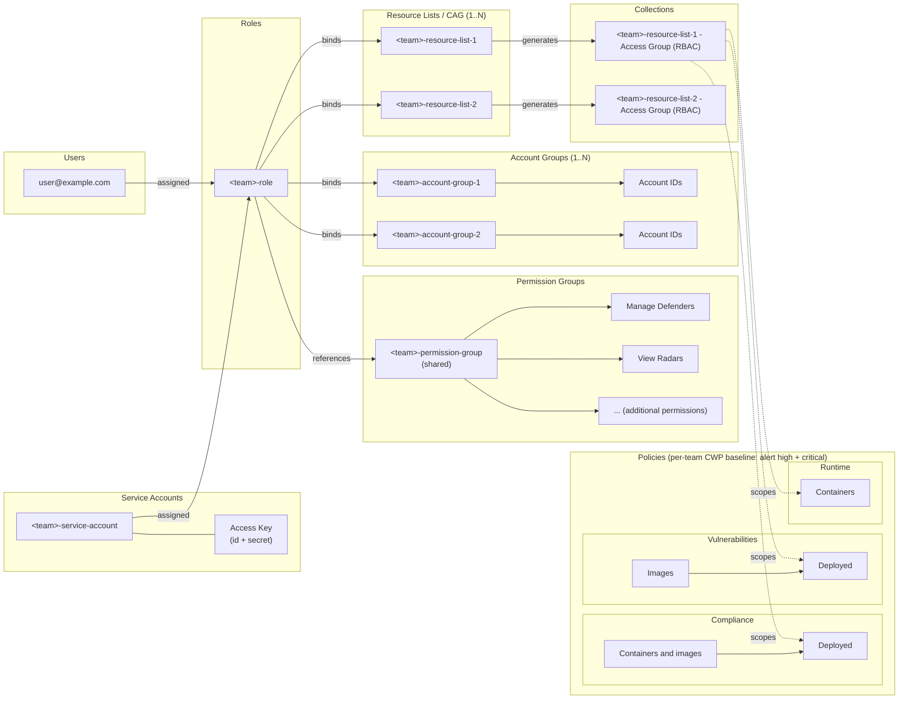

## [`RBAC`](terraform/modules/rbac)

Manage RBAC objects (Roles, Account Groups, Resource Lists, Permission Groups, etc.) in Prisma Cloud.

## Flow

- Users and the Service Account are both assigned the team Role. The Service Account carries an Access Key (id + secret) for programmatic/CI access.
- The Role references the shared Permission Group and binds the team's Account Groups and Resource Lists (Compute Access Groups).
- Each Resource List auto-spawns a Collection named `<resource-list> - Access Group (RBAC)` on the Runtime Security side.
- Those Collections scope the per-team CWP policy baseline (Compliance, Vulnerabilities, Runtime), which alerts on high and critical findings.
