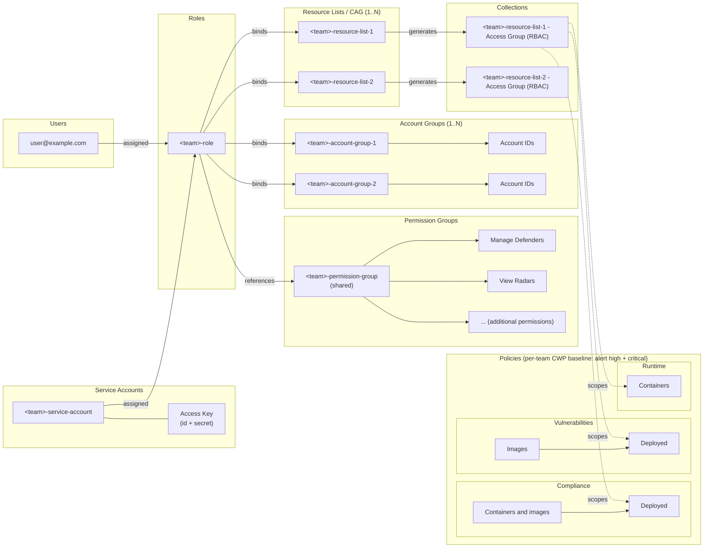
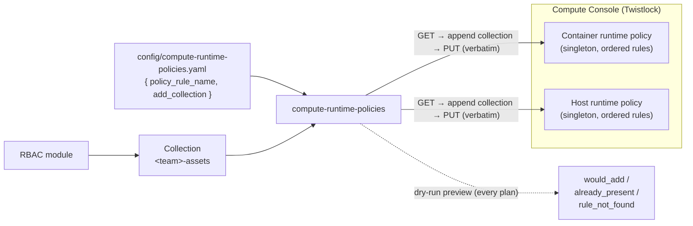
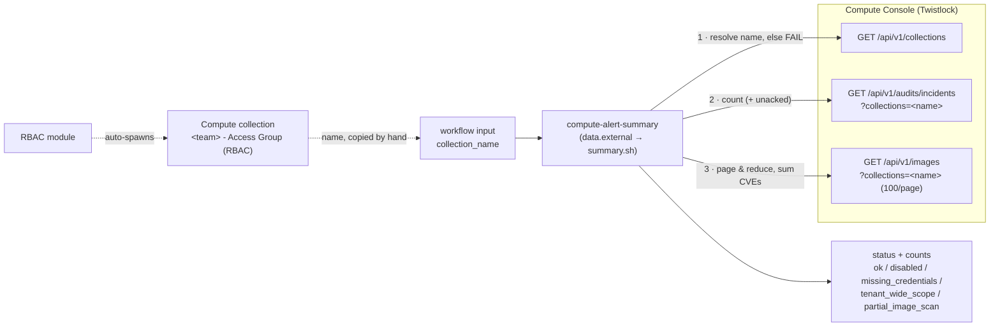
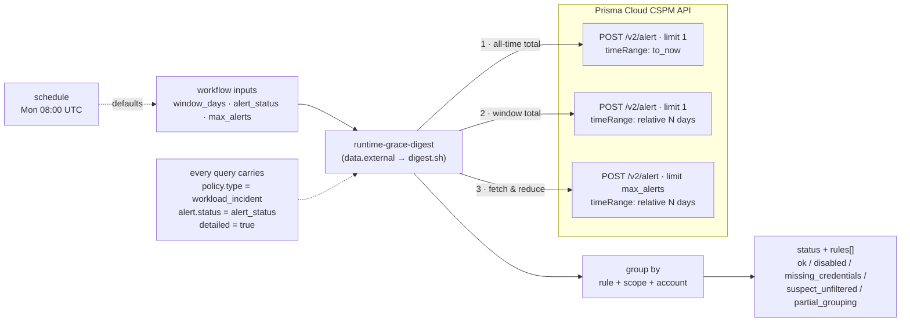

## [`RBAC`](terraform/modules/rbac)

Manage RBAC objects (Roles, Account Groups, Resource Lists, Permission Groups, etc.) in Prisma Cloud.

## Flow

- Users and the Service Account are both assigned the team Role. The Service Account carries an Access Key (id + secret) for programmatic/CI access.
- The Role references the shared Permission Group and binds the team's Account Groups and Resource Lists (Compute Access Groups).
- Each Resource List auto-spawns a Collection named `<resource-list> - Access Group (RBAC)` on the Runtime Security side.
- Those Collections scope the per-team CWP policy baseline (Compliance, Vulnerabilities, Runtime), which alerts on high and critical findings.

## [`compute-runtime-policies`](terraform/modules/compute-runtime-policies)

Attaches an RBAC Collection to **existing** Compute **runtime** policy rules (Container +
Host) so console-authored policies apply to a team's resources. It does **not** create or
change policies — it only appends the collection to a matched rule, preserving the rest.
Because runtime policies are tenant-wide singletons, this is done via a non-destructive
**API read-merge-write** (mechanism B) rather than a Terraform provider resource.

### Flow

- The admin authors runtime policies in the Compute console (they own the policy content).
- The admin records, in `config/compute-runtime-policies.yaml`, which existing rule should
  cover which RBAC Collection, then commits + pushes — which triggers the GitHub Action.
- On `plan`, the module reads each live policy and previews per association whether the
  collection would be added, is already present, or the rule name wasn't found.
- On the gated `apply`, the module `GET`s the policy, appends the collection to the matched
  rule's `collections` (idempotent, preserving all existing collections and fields), and
  `PUT`s the exact object back — so only the targeted scoping changes.

## [`compute-alert-summary`](terraform/modules/compute-alert-summary)

Counts runtime incidents and image CVEs for one **Compute** collection. Read-only by
construction: `data` blocks only, so a plan has zero resource changes.

It is the **sibling** of [`alert-summary`](terraform/modules/alert-summary), which counts
**CSPM alerts** in a **CSPM Collection**. Prisma has two unrelated collection systems, and
these two modules read one each — the Compute `- Access Group (RBAC)` collections an RBAC
Resource List spawns do not exist on the CSPM side at all. **Their counts describe
different objects and must never be added together.**

### Flow

- The admin copies the collection name from the Compute console — Compute collections have
  **no id**, the name is the identifier, and the filter is exact-match and case-sensitive.
- The script resolves that name against the collection list **first** and fails with a
  suggestion on a case mismatch, rather than querying and returning a plausible wrong
  number. An empty name is refused: an absent filter returns the whole tenant.
- Incident and image counts come from server-side totals. The CVE severity rollup pages
  `/images` and reduces each page before fetching the next (~48 MB → ~14 KB), capped by
  `max_images`; when the cap is hit the run reports `partial_image_scan` and says the
  severity numbers are a sample.
- The workflow branches on the `status` output, never on the exit code: a failing `check`
  does not fail a plan, and `terraform show -json` omits check results from a plan file
  entirely.

## [`runtime-grace-digest`](terraform/modules/runtime-grace-digest)

Reports **which runtime rules are still firing**, grouped by rule + workload scope +
cloud account. Read-only by construction: `data` blocks only, so a plan has zero
resource changes.

It reads the **CSPM** alerts API, not the Compute Console. Runtime incidents are promoted
into the CSPM stream as `workload_incident` alerts, and the promoted copy carries the
runtime rule name (`metadata.auditRuleName`), an occurrence count, and the full dismissal
lifecycle — none of which the raw Compute incident offers on one call.

**It measures recurrence, not age.** A runtime incident is an event: it happened, nothing
un-happens it, and incidents never expire. "Older than N days" selects nearly everything
ever recorded (measured: 14,398 of 14,410) and only really tracks whether somebody clicked
acknowledge. "Still firing in the last N days" is answerable and self-clearing.

### Flow

- All three queries carry the same filters; only `timeRange` and `limit` differ.
  `detailed=true` is mandatory — without it `totalRows` is `0`, which reads as "no
  findings".
- Two count queries run **before** the detail fetch: an all-time baseline and the window.
  If a short window returns exactly the all-time count, the run reports
  `suspect_unfiltered` — the alerts API answers HTTP 200 and returns the **whole tenant**
  for a filter name it does not recognise, so equality is what a silently dropped filter
  looks like. The threshold is 90 days, because a long window legitimately covers
  everything.
- `scope` (container vs host) is derived from `policy.name`, **not** `metadata.auditType`
  — auditType is the audit kind (Filesystem/Network/Processes). The same rule name can
  exist in both the container and host policies, so scope is part of the grouping key;
  merging them would point a later escalation at the wrong policy.
- `limit` is a cap, not a page size: when it is hit the remainder is simply absent. The
  module compares the server-side window total against the rows actually fetched and
  reports `partial_grouping`, and the workflow prints that warning **above** the table
  with the affected figures tagged `(sampled)` — rules below the cut-off are missing
  entirely, not undercounted.
- Alerts attributed to `default` (the built-in learned model) are counted separately: there
  is no named rule to escalate, so presenting them as an actionable row would send someone
  looking for a rule that is not in the console.
- The workflow branches on `status`, never the exit code, on the same basis as its
  siblings. `disabled` and `missing_credentials` fail the run loudly rather than rendering
  an empty report, which would be a false all-clear.
