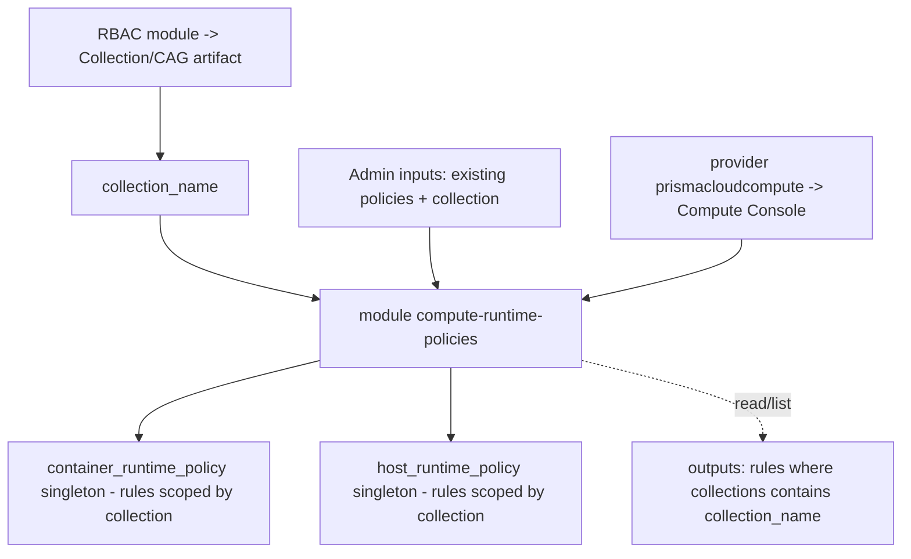

# Plan: `compute-runtime-policies` Module (Container & Host Runtime Policies)

Branch: `tuan_test_compute_policies` (off `tuan_test`).

Scope (REVISED per answers 2026-07-22): **runtime policies only** — exactly two
provider resources:
- [`prismacloudcompute_container_runtime_policy`](https://registry.terraform.io/providers/PaloAltoNetworks/prismacloudcompute/latest/docs/resources/container_runtime_policy)
- [`prismacloudcompute_host_runtime_policy`](https://registry.terraform.io/providers/PaloAltoNetworks/prismacloudcompute/latest/docs/resources/host_runtime_policy)

(Vulnerability + Compliance types are OUT of scope now.)

---

## 0. Confirmed facts (from `terraform providers schema -json`, provider v0.8.0)

Everything below is authoritative — pulled from the installed provider, not guessed.

### Provider auth (`provider "prismacloudcompute"`)
```
console_url             (optional, string)   # Compute Console URL
username                (optional, string)
password                (optional, string)
project                 (optional, string)   # multi-project consoles
skip_cert_verification  (optional, bool)
config_file             (optional, string)
```

### `prismacloudcompute_container_runtime_policy` (SINGLETON)
- `id` (computed), `learning_disabled` (bool)
- `rule` (ordered LIST of blocks); each rule:
  - `name` (required), `collections` (list(string)), `disabled`, `notes`,
    `previous_name`, `advanced_protection_effect`,
    `cloud_metadata_enforcement_effect`, `kubernetes_enforcement_effect`,
    `skip_exec_sessions`, `wildfire_analysis`
  - nested blocks: `processes{}`, `network{}` (+ `listening_ports`/`outbound_ports`
    with `allowed`/`denied` ranges), `dns{}` (+ `domain_list`), `filesystem{}`
    (+ `denied_list`), `custom_rule{}`

### `prismacloudcompute_host_runtime_policy` (SINGLETON)
- `id` (computed)
- `rule` (ordered LIST of blocks); each rule:
  - `name`, `collections` (list(string)), `disabled`, `notes`
  - nested blocks: `activities{}`, `antimalware{}` (+ `denied_processes`),
    `custom_rule{}`, `dns{}`, `file_integrity_rule{}`, `log_inspection_rule{}`,
    `network{}` (+ `denied_listening_port`/`denied_outbound_port`)

### `prismacloudcompute_collection` (resource exists)
- `name` (required) + workload selectors: `account_ids`, `clusters`, `namespaces`,
  `images`, `hosts`, `labels`, `containers`, `functions`, `application_ids`,
  `code_repositories`, `color`, `description`.
- This is the Compute-side collection. **The `collections` field on each policy rule
  is a list of collection *names*** — this is the scoping seam to an RBAC artifact.

### ⚠️ BLOCKER — data sources (answer #3)
The provider ships **only two data sources**: `prismacloudcompute_custom_compliance`
and `prismacloudcompute_custom_rule`. **There is NO data source for runtime policies
and NO data source for collections.**

So requirement #3 — *"run data source providers that list already-established policies
for resources under a specific RBAC artifact"* — **cannot** be met with a native
provider data source. Options (needs a decision, see §4):
- **(W1) `import` + filter**: import the singleton policy into Terraform state, then
  expose an `output`/`local` that filters `rule[*]` where `contains(collections, <name>)`.
  Gives a Terraform-native "list rules for this collection," but Terraform then *owns*
  the whole singleton policy (drift/ownership implications).
- **(W2) `external` data source**: a small script (curl to the Compute API
  `GET /api/v1/policies/runtime/container|host`) returning JSON, filtered in Terraform.
  Read-only, no ownership, but adds a script dependency + Compute API auth in the data
  source.
- **(W3) `http` data source**: same idea, pure-Terraform via `hashicorp/http`, but the
  Compute API needs a bearer token (a first call to `POST /api/v1/authenticate`), which
  `http` alone can't chain cleanly — usually still needs `external`.

---

## 1. Answers received (2026-07-22)

1. Scope = the two runtime policy resources above. ✅ (schema confirmed they exist)
2. **Users = Prisma Cloud admins** who run the module. Inputs they provide:
   - the **collection/group** the resources belong to (the artifact created by the RBAC
     module), and
   - the **pre-created policies already in the environment**.
   → Implication: the module is **admin-facing** and operates against **existing**
   policies + an **existing** collection, rather than bootstrapping a per-team baseline.
3. Want **data sources** to **list already-established policies** for resources under a
   specific RBAC artifact (collection). → blocked by provider (see §0), needs W1/W2/W3.

### Decision round 2 (2026-07-22)
- **D2 → read-only.** Policies are **created on the Prisma Cloud console by the admins**
  themselves (they are new and need console practice). The module must therefore **NOT**
  create/own the tenant-wide runtime policies. Its job is to **read/list** the rules that
  apply to a given RBAC collection and give admins a fast way to see/verify their work.
- **D1 → W2 (read-only `external` data source).** Because D2 rules out ownership, W1
  (import + Terraform ownership) is off the table. See pros/cons in §1a.
- **D3 → confirmed.** `console_url = https://us-east1.cloud.twistlock.com/us-2-158320372`;
  Compute auth reuses the **same client id / secret as CSPM** (access key + secret key).
- **D4 → `config/compute-runtime-policies.yaml`** (admins want to define the YAML in
  advance). Git-ignored like teams.yaml; `git add -f` for CI.
- **D5 → clarified below** (rule "effect": alert vs prevent vs block). Since D2 is
  read-only, D5 only matters if/when a future write-path is added; for the read-only
  lister it is N/A. Recorded for later.

### 1a. D1 pros/cons — W1 (import + filter) vs W2 (external, read-only)

| Dimension | W1: import the singleton policy into TF state, filter rules | W2: `external` data source calls Compute API, filter in TF |
|---|---|---|
| Ownership | Terraform **OWNS** the tenant-wide policy. On apply it will **delete any rule not in config**. To be safe you must reproduce EVERY existing rule in HCL. | **No ownership.** Pure read. Console stays the source of truth. |
| Fits D2 (admins create in console) | ✗ Conflicts — TF would fight the admins' console edits and revert them each apply. | ✓ Exactly matches — admins create in console, TF just reports. |
| "List policies for a collection" | ✓ Native once imported (`for r in ...rule : r if contains(r.collections, name)`). | ✓ Same filtering, but on JSON returned by the script. |
| Drift behavior | Every out-of-band console edit shows as drift / gets reverted. High friction for a learning team. | Reflects live console state on every `plan`/`refresh`. No revert. |
| Dependencies | Provider only. No scripts. | Adds a script (curl/jq or a tiny Go/py) + `hashicorp/external`. Compute API auth = `POST /api/v1/authenticate` to get a token, then `GET /api/v1/policies/runtime/{container,host}`. |
| Blast radius | High — a bad apply can wipe real runtime rules tenant-wide. | Low — read-only, cannot change the tenant. |
| CI secrets | Reuses provider auth. | Needs the same creds exposed to the script (env), reusing CSPM key/secret per D3. |
| Idempotence w/o backend | Poor — singleton + no remote backend = risky repeated applies. | Excellent — nothing to apply. |
| Effort | Lower HCL, higher operational risk. | Slightly more plumbing (auth script), much lower risk. |

**Chosen: W2 for the READ, plus a narrowly-scoped, non-destructive WRITE (read-merge-write).**

### Refinement (2026-07-22, post-"go"): the module must APPLY policies to resources
Clarified requirement: the module must **apply an existing policy to the RBAC artifact's
resources** — i.e. **add the RBAC collection to a target rule's `collections` list** —
while **NOT** creating or otherwise changing the policy, and **preserving the collections
/ resources already on that rule**.

In this provider a runtime policy is a **singleton whole-policy resource**; you cannot
patch one rule's `collections` in isolation. The safe pattern is **read-merge-write**:
1. **READ** the live policy via the `external` data source (all rules + their current
   `collections`) — this is the W2 mechanism, now reused as the seed.
2. **MERGE**: union the RBAC collection name into the target rule's `collections`
   (preserving every existing collection), leaving all other rules byte-for-byte as read.
3. **WRITE** the whole policy back via
   `prismacloudcompute_container_runtime_policy` / `host_runtime_policy`, seeded from the
   live read so nothing else changes. Net effect on `terraform plan`: a single rule's
   `collections` gains our entry; everything else is a no-op.

This is NOT "W1 ownership from scratch" (which would delete unknown rules). It is an
append driven by the live state, so it does not create or redefine policies.

> ⚠️ Residual risk (documented for the admins): between the seed READ (plan time) and the
> next apply, if an admin edits the SAME policy in the console, Terraform's write is based
> on the seed and could revert those concurrent edits on that policy. Mitigations: (a) the
> external read runs every plan so the seed is always fresh; (b) apply promptly after
> plan; (c) the module only ever *adds* to `collections`, never removes, minimizing
> surprise. This is the unavoidable cost of a singleton whole-policy resource.

> Note on D5 wording: a runtime **rule "effect"** is what an action does when matched —
> typically one of `alert` (log only), `prevent` (block that action), `block` (kill the
> container/process), or `disable`. That choice applies when *authoring* rules. We do NOT
> author rules (admins do that in the console); we only touch `collections`, so D5 stays
> deferred.

---

## 2. Interpreted purpose (mirrors RBAC's "simplify onboarding" reason-to-exist)

RBAC simplifies *granting a team scoped access*. This module simplifies *managing the
runtime security posture for that same team's scope*: given the collection an RBAC team
owns, an admin can (a) **see** which runtime rules currently apply to that collection,
and (b) **manage** (add/adjust) the container/host runtime rules scoped to it — without
hand-editing the giant tenant-wide singleton policies in the Compute console.

The unit of abstraction is therefore the **collection (RBAC artifact)**, and the module
is a thin, safe lens over the two tenant-wide singleton runtime policies filtered/scoped
by that collection.

---

## 3. Module: `terraform/modules/compute-runtime-policies` (read-merge-write append)

### Config (D4) — `terraform/config/compute-runtime-policies.yaml`
Admins pre-define which RBAC collection to attach to which existing policy rule:
```yaml
container:
  - policy_rule_name: "default - alert on suspicious runtime behavior"  # existing rule
    add_collection: "tuan-test-assets"                                  # RBAC artifact
host:
  - policy_rule_name: "Default - alert on suspicious runtime behavior"
    add_collection: "tuan-test-assets"
```
Git-ignored like teams.yaml; `git add -f` for CI. An `.example` variant is committed.

### Module inputs
- `container_associations` = list(object({ policy_rule_name, add_collection }))
- `host_associations`      = list(object({ policy_rule_name, add_collection }))
- `console_url`, `username`, `password` (passed from root for the external read script)
- `manage_container` / `manage_host` (bool) — only write a policy if it has associations.

### Mechanism (read-merge-write)
1. `data "external" "container_policy"` / `"host_policy"` — a script authenticates to the
   Compute API and returns the live policy as JSON (all rules + collections + every other
   field, base64-packed to survive the flat string map `external` requires).
2. `locals` decode the JSON, and for each rule compute the merged `collections` =
   `distinct(concat(existing, [add_collection]))` when the rule name matches an
   association; otherwise leave the rule untouched.
3. **CHOSEN: mechanism (B) API-driven merge (2026-07-22).** No provider policy resource.
   Instead:
   - `data "external" "container_preview"` / `"host_preview"` runs `scripts/preview.sh`,
     which authenticates + `GET`s the policy and returns a DRY-RUN summary: for each
     association, whether the collection is already present or WOULD be added (+ rule
     found/not-found). This is the plan-preview compensator for `local-exec`.
   - `resource "null_resource" "apply"` runs `scripts/merge_apply.sh` on apply: `GET`
     the policy → for each association append `add_collection` to the matching rule's
     `collections` (idempotent `distinct`) → `PUT` the exact same object back verbatim.
     Triggered by a hash of the associations so it re-runs when config changes.
   Fidelity is guaranteed because the script round-trips the policy JSON unchanged except
   for the targeted `collections` arrays.

### Outputs
- `container_preview` / `host_preview` — the dry-run: per association, `would_add` /
  `already_present` / `rule_not_found`. Doubles as the listing capability (requirement #3).
- `apply_id` — the null_resource id (proves the merge ran).

> Idempotence: `merge_apply.sh` uses `distinct()` so re-running never duplicates a
> collection, and PUTs the same bytes when nothing changed. Safe under the no-backend CI.
> The dry-run preview runs on every `plan` so admins see the effect before the gated apply.

---

## 4. All decisions resolved (see §1 "Decision round 2" + §1a refinement)
- D1: W2 read + non-destructive write (read-merge-write). ✅
- D2: do not create/redefine policies; only append `collections`. ✅
- D3: console_url + CSPM key/secret. ✅
- D4: `config/compute-runtime-policies.yaml`. ✅
- D5: N/A (we don't author rule effects). ✅

---

## 5. Auth / provider wiring (root) — unchanged from prior plan
- `versions.tf`: `prismacloudcompute` pinned `~> 0.8` (v0.8.0 installed). ✅ done
- `providers.tf`: add `provider "prismacloudcompute" { console_url/username/password }`.
- `variables.tf`: add `prisma_compute_console_url/username/password` (sensitive, null
  default so CI injects via `TF_VAR_*`).

## 6. CI / docs
- **Trigger (confirmed 2026-07-22):** the admin commits + pushes the change to
  `config/compute-runtime-policies.yaml`, which kicks off the GitHub Action. So `push`
  on that config path must trigger the workflow; the actual write (append collection)
  goes through the **gated apply** (higher blast radius than a read).
- Add Compute Console secret → `TF_VAR_prisma_compute_console_url` in the workflow
  (access key/secret reuse the existing CSPM secrets).
- Update `ARCHITECTURE_DIAGRAM.md` + `README.md` + module `README.md`.

## 6a. Write-mechanism decision (A vs B) — the append itself
Because the runtime policy is a singleton whole-policy resource, "add one collection to
one rule" can be done two ways:
- **(A) Provider resource**, rebuilt from an external-read seed via `dynamic "rule"`.
  Con: must reproduce EVERY field of EVERY rule the provider supports (10+ nested blocks
  on container) or dropped fields get zeroed on write. Fragile, large surface.
- **(B) API-driven merge** via a script (`GET` policy → append collection to the target
  rule → `PUT` the exact object back). Round-trips the policy JSON verbatim, so fidelity
  is guaranteed and only `collections` changes. Con: imperative (`null_resource` +
  `local-exec`), weaker `plan` preview.
Given the fidelity risk of (A) and the CI-driven flow, **lean (B)** — pending user's OK.

## 7. Validation
- `terraform init/validate/plan` locally (terraform v1.13.3 installed), then gated CI.

---

## Flow (proposed)


