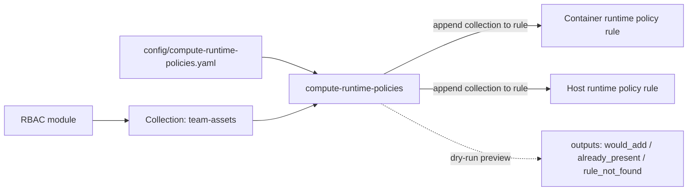

# compute-runtime-policies

Attaches an RBAC artifact's **Collection** to **existing** Prisma Cloud Compute
**runtime** policy rules — Container ([`prismacloudcompute_container_runtime_policy`](https://registry.terraform.io/providers/PaloAltoNetworks/prismacloudcompute/latest/docs/resources/container_runtime_policy))
and Host ([`prismacloudcompute_host_runtime_policy`](https://registry.terraform.io/providers/PaloAltoNetworks/prismacloudcompute/latest/docs/resources/host_runtime_policy)) —
so a console-authored policy **applies to that team's resources**.

The module **does not create or redefine** policies or rules. It only **appends** the
named collection to a matched rule's `collections` list, **preserving** everything
already there. This is the runtime-security counterpart to what [`../rbac`](../rbac)
does for access: RBAC scopes *who* can see a team's resources; this scopes *which
runtime policy rules apply* to them.



## Why a script instead of the provider resource

Compute runtime policies are **tenant-wide singletons**: the whole ordered rule set is
one object, and there's no way to patch a single rule's `collections` via the provider
resource without owning (and thus being able to delete) every other rule. To add our
collection **without risking any existing rule or field**, the module uses an
**API read-merge-write** (mechanism B):

1. **Preview (read-only, every plan):** a [`data "external"`](main.tf) runs
   [`scripts/preview.sh`](scripts/preview.sh) — authenticate → `GET` the policy → report,
   per association, whether the collection is `already_present`, `would_add`, or the rule
   was `rule_not_found`.
2. **Apply (write):** a `null_resource` runs [`scripts/merge_apply.sh`](scripts/merge_apply.sh) —
   `GET` the policy → append the collection to the matched rule's `collections`
   (idempotent; `distinct`) → `PUT` the **exact same object** back. Round-tripping the
   JSON verbatim guarantees no other rule or field is ever clobbered.

The provider (`prismacloudcompute`) is registered at the root for auth/consistency, but
this module talks to the Compute API directly via the scripts.

## Requirements

- Runtime tools on the runner: `bash`, `curl`, `jq` (present on `ubuntu-latest`).
- Providers: `hashicorp/external`, `hashicorp/null`.

## Usage

```hcl
module "compute_runtime_policies" {
  source = "./modules/compute-runtime-policies"

  console_url = var.prisma_compute_console_url          # Compute Console URL
  access_key  = var.prisma_cloud_access_key             # same as CSPM
  secret_key  = var.prisma_cloud_secret_key             # same as CSPM

  container_associations = [
    { policy_rule_name = "Default - alert on suspicious runtime behavior", add_collection = "team-assets" },
  ]
  host_associations = [
    { policy_rule_name = "Default - alert on suspicious runtime behavior", add_collection = "team-assets" },
  ]
}
```

In this repo the root module drives it from
[`config/compute-runtime-policies.yaml`](../../config/compute-runtime-policies.yaml)
(git-ignored — copy from the committed `.example.yaml` and `git add -f` for CI).

## Inputs

| Variable | Required | Default | Purpose |
|---|---|---|---|
| `console_url` | yes | — | Compute Console URL. |
| `access_key` | yes | — | Access key id (sensitive). Reused from CSPM. |
| `secret_key` | yes | — | Secret key (sensitive). Reused from CSPM. |
| `skip_cert_verification` | no | `false` | Pass `-k` to curl for the Compute API. |
| `container_associations` | no | `[]` | List of `{ policy_rule_name, add_collection }` for the container runtime policy. |
| `host_associations` | no | `[]` | List of `{ policy_rule_name, add_collection }` for the host runtime policy. |
| `enable_list` | no | `false` | When true, read both runtime policies and expose the listing outputs below (read-only). |
| `list_collection_filter` | no | `""` | With `enable_list`, restrict `*_rules_by_collection` to this one collection name. Empty = index all. |
| `list_clusters` | no | `[]` | With `enable_list`, resolve which runtime rules apply to each named cluster (cluster → cluster-specific collections → rules). Empty = skip cluster resolution (no extra API call). |

Empty association lists = the module is a no-op for that policy kind (no read, no write).
`enable_list` is independent of associations — you can list without changing anything.

## Outputs

| Output | Use |
|---|---|
| `container_preview` | Dry-run status per container association (`would_add` / `already_present` / `rule_not_found`) + each rule's existing collections. Null when no associations. |
| `host_preview` | Same for the host runtime policy. |
| `container_apply_id` / `host_apply_id` | The `null_resource` id, proving the merge ran. Null when unmanaged. |
| `container_policy_rules` / `host_policy_rules` | **Direction 1 — full dump:** every rule as `{ name, disabled, collections }`. Null unless `enable_list`. |
| `container_rules_by_collection` / `host_rules_by_collection` | **Direction 2 — lookup:** map of collection name => rule names referencing it (restricted to `list_collection_filter` when set). Answers "which runtime rules apply to this RBAC collection?" Null unless `enable_list`. |
| `container_rules_by_cluster` / `host_rules_by_cluster` | **Direction 3 — cluster lookup:** map of cluster name => `{ collections, rules }`. Answers "which runtime rules apply to this cluster?" Populated only when `list_clusters` is set. Null unless `enable_list`. |

## Listing (read-only) — the three directions

```hcl
module "compute_runtime_policies" {
  source      = "./modules/compute-runtime-policies"
  console_url = var.prisma_compute_console_url
  access_key  = var.prisma_cloud_access_key
  secret_key  = var.prisma_cloud_secret_key

  enable_list            = true
  list_collection_filter = "team-assets"          # optional; omit to index all collections
  list_clusters          = ["hs-cluster-1", "mb-eks"] # optional; resolve rules per cluster
}
```
- **Direction 1** (`*_policy_rules`): a full dump of every runtime rule and its attached
  collections — "what does this policy contain?"
- **Direction 3** (`*_rules_by_cluster`): a `cluster -> { collections, rules }` map —
  "which runtime rules apply to this cluster?" Resolves cluster → cluster-specific
  collections (exact name or targeted glob; the `*`/`All` wildcard is excluded) → the
  runtime rules bound to those collections. Requires `list_clusters`.
- **Direction 2** (`*_rules_by_collection`): a `collection -> [rules]` index — "which
  rules apply to this collection (RBAC artifact)?" This is powered by
  [`scripts/list.sh`](scripts/list.sh) and makes NO changes.

## Notes & caveats

- **Idempotent:** re-running never duplicates a collection and `PUT`s nothing when the
  policy is already correct.
- **Non-destructive:** only the targeted rules' `collections` change; every other rule
  and field is written back byte-for-byte as read.
- **Concurrent console edits:** because the policy is a singleton, if an admin edits the
  *same* policy in the console between this module's `GET` and `PUT`, those edits could be
  overwritten. The `GET` happens immediately before the `PUT` in the same run to minimize
  the window; apply promptly after review.
- **`rule_not_found`:** the `policy_rule_name` must match the rule name exactly as shown
  in the Compute console. Check `*_preview` on `plan` before applying.
