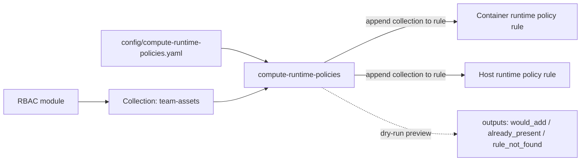

# compute-runtime-policies

Attaches an RBAC artifact's **Collection** to **existing** Prisma Cloud Compute **runtime** policy rules — Container ([`prismacloudcompute_container_runtime_policy`](https://registry.terraform.io/providers/PaloAltoNetworks/prismacloudcompute/latest/docs/resources/container_runtime_policy)) and Host ([`prismacloudcompute_host_runtime_policy`](https://registry.terraform.io/providers/PaloAltoNetworks/prismacloudcompute/latest/docs/resources/host_runtime_policy)).

Does not create or redefine policies/rules — only appends the named collection to a matched rule's `collections` list, preserving everything already there. Runtime-security counterpart to [`../rbac`](../rbac): RBAC scopes *who* sees a team's resources; this scopes *which runtime rules apply* to them.



Runtime policies are tenant-wide singletons — the whole ordered rule set is one object. To append a collection without touching any other rule, the module does an **API read-merge-write**:

1. **Preview (read-only, every plan):** [`data "external"`](main.tf) runs [`scripts/preview.sh`](scripts/preview.sh) — `GET` the policy → report per association: `already_present` / `would_add` / `rule_not_found`.
2. **Apply (write):** `null_resource` runs [`scripts/merge_apply.sh`](scripts/merge_apply.sh) — `GET` → append collection to the matched rule's `collections` (idempotent, `distinct`) → `PUT` the exact same object back.

The `prismacloudcompute` provider is registered at the root for auth; this module talks to the Compute API directly via scripts.

## Requirements

- `bash`, `curl`, `jq` on the runner (present on `ubuntu-latest`).
- Providers: `hashicorp/external`, `hashicorp/null`.

## Usage

```hcl
module "compute_runtime_policies" {
  source = "./modules/compute-runtime-policies"

  console_url = var.prisma_compute_console_url          # Compute Console URL
  access_key  = var.prisma_cloud_access_key             # same as CSPM
  secret_key  = var.prisma_cloud_secret_key             # same as CSPM

  container_associations = [
    { policy_rule_name = "Default - alert on suspicious runtime behavior", add_collection = "team-assets" },
  ]
  host_associations = [
    { policy_rule_name = "Default - alert on suspicious runtime behavior", add_collection = "team-assets" },
  ]
}
```

Root module drives it from [`config/compute-runtime-policies.yaml`](../../config/compute-runtime-policies.yaml) (git-ignored — copy from `.example.yaml`, `git add -f` for CI).

## Inputs

| Variable | Required | Default | Purpose |
|---|---|---|---|
| `console_url` | yes | — | Compute Console URL. |
| `access_key` | yes | — | Access key id (sensitive). Reused from CSPM. |
| `secret_key` | yes | — | Secret key (sensitive). Reused from CSPM. |
| `skip_cert_verification` | no | `false` | Pass `-k` to curl for the Compute API. |
| `container_associations` | no | `[]` | `{ policy_rule_name, add_collection }` list. |
| `host_associations` | no | `[]` | `{ policy_rule_name, add_collection }` list. |
| `enable_list` | no | `false` | Read both runtime policies and expose the listing outputs (read-only). |
| `list_collection_filter` | no | `""` | Restrict `*_rules_by_collection` to this collection. Empty = all. |
| `list_clusters` | no | `[]` | Resolve which runtime rules apply to each named cluster. Empty = skip. |

Empty association lists = no-op for that policy kind. `enable_list` is independent of associations.

## Outputs

| Output | Use |
|---|---|
| `container_preview` | Dry-run status per container association + existing collections. Null when no associations. |
| `host_preview` | Same for host runtime policy. |
| `container_apply_id` / `host_apply_id` | `null_resource` id, proving the merge ran. Null when unmanaged. |
| `container_policy_rules` / `host_policy_rules` | Full dump: every rule as `{ name, disabled, collections }`. Null unless `enable_list`. |
| `container_rules_by_collection` / `host_rules_by_collection` | Map of collection name => rule names. Null unless `enable_list`. |
| `container_rules_by_cluster` / `host_rules_by_cluster` | Map of cluster name => `{ collections, rules }`. Populated only with `list_clusters`. Null unless `enable_list`. |

## Listing (read-only) — the three directions

```hcl
module "compute_runtime_policies" {
  source      = "./modules/compute-runtime-policies"
  console_url = var.prisma_compute_console_url
  access_key  = var.prisma_cloud_access_key
  secret_key  = var.prisma_cloud_secret_key

  enable_list            = true
  list_collection_filter = "team-assets"          # optional; omit to index all collections
  list_clusters          = [] # optional; e.g. ["my-cluster"] to resolve rules per cluster
}
```
- **Direction 1** (`*_policy_rules`): full dump of every runtime rule + attached collections.
- **Direction 2** (`*_rules_by_collection`): `collection -> [rules]` index, via [`scripts/list.sh`](scripts/list.sh), no changes.
- **Direction 3** (`*_rules_by_cluster`): `cluster -> { collections, rules }` map. Resolves cluster → cluster-specific collections (wildcard excluded) → bound rules. Requires `list_clusters`.

## Notes & caveats

- Idempotent — re-running never duplicates a collection, `PUT`s nothing when already correct.
- Non-destructive — only targeted rules' `collections` change; everything else written back byte-for-byte.
- Concurrent console edits to the same policy between `GET` and `PUT` can be overwritten — `GET` happens immediately before `PUT` to minimize the window.
- `rule_not_found` means `policy_rule_name` didn't match exactly. Check `*_preview` before applying.
