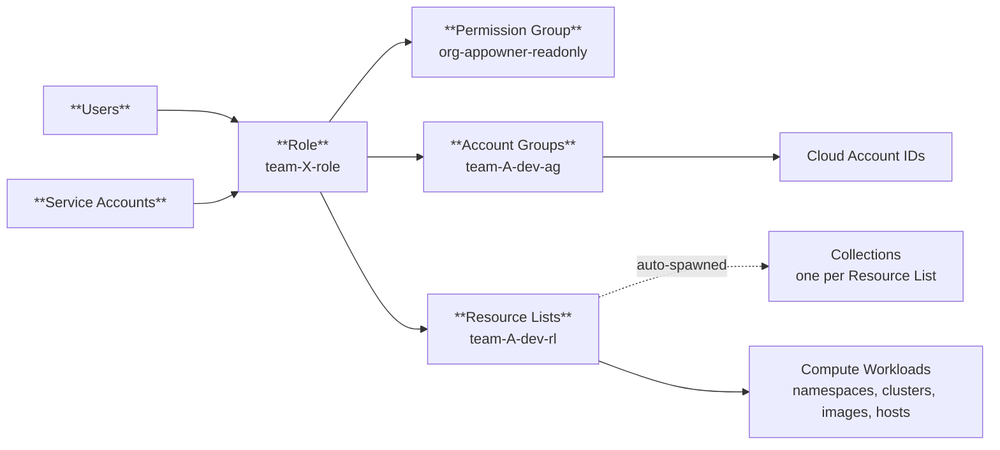

# rbac

Provisions one team's Prisma Cloud RBAC artifacts — Account Group(s), Resource List(s), a custom Role, an optional Service Account, and an optional CSPM Alert Rule — bound to a shared Permission Group. One module instance per entry in [`config/teams.yaml`](../../config/teams.yaml).



See [`ARCHITECTURE_DIAGRAM.md`](../../../ARCHITECTURE_DIAGRAM.md) for the full diagram.

Deployment-specific ops (ownership roles, incident playbook, risk-acceptance, IdP handoff, tenant prerequisites): [Operations Runbook](../../../.etc/OPERATIONS_RUNBOOK.md).

## Usage

```hcl
module "team_alpha" {
  source = "./modules/rbac"

  providers = { prismacloud = prismacloud }

  team_name             = "team-alpha"
  permission_group_id   = prismacloud_permission_group.app_owner_readonly_singleton.id
  permission_group_name = prismacloud_permission_group.app_owner_readonly_singleton.name

  account_groups = [
    { name = "team-alpha-ag", account_ids = ["111111111111"] },
  ]

  resource_lists = [
    {
      name                 = "team-alpha-rl"
      compute_access_group = { namespaces = ["team-alpha-*"] }
    },
  ]
}
```

Root module fans this out over [`config/teams.yaml`](../../config/teams.yaml) with `for_each`; see [`terraform/main.tf`](../../main.tf).

## What the module creates

| Artifact | Purpose |
|---|---|
| Account Group(s) | Scopes the team to cloud account IDs. 1..N via `account_groups`. |
| Resource List(s) (CAG) | Scopes the team to Compute workloads (namespaces, clusters, images, hosts, labels). 1..N via `resource_lists`. |
| Role | Binds all Account Groups + Resource Lists + the shared Permission Group. IdP maps SAML groups to this Role's ID. |
| Auto-Collection(s) | Prisma Cloud spawns a read-only Collection named `<resource_list_name> - Access Group (RBAC)` per Resource List. [`auto_collection_expected_names`](outputs.tf) gives the expected name; [`resource_list_collection_ids`](outputs.tf) resolves the live ID. |
| Dashboard Collection | Terraform-managed Collection (`<team>-collection`) for dashboards/widgets. Scopes by Account Group only — `prismacloud_collection` has no CAG filter. |
| Alert Rule (CSPM) | Scoped to the team's Account Group(s) + Resource List, fires on high+critical by default. Compute/CWP findings not routed here. |
| Service Account (optional) | Set `service_account_name` → SERVICE_ACCOUNT profile + access key. Key id/secret returned as outputs (secret is sensitive). |
| Team member assignments (optional) | `team_members` grants the team Role to existing users, preserving other roles (union). Adopted via import block. Runs last. |

Module does not create users — SAML groups map to role IDs in the IdP; see [Operations Runbook](../../../.etc/OPERATIONS_RUNBOOK.md).

### The auto-spawned Collection

Every `prismacloud_resource_list` causes Prisma Cloud to spawn a companion Collection named `<resource_list_name> - Access Group (RBAC)` — server-side, not declared by Terraform, `owner = "Prisma Cloud"`, `system = true`, appears only after apply. Not deletable.

Name suffix `- Access Group (RBAC)` is platform-generated and fixed; only `resource_list_name_suffix` (the prefix) is controllable.

Contains spaces/parentheses — fails the Compute runtime-policy charset `^[A-Za-z0-9_:-]+$`. Permanently unusable for runtime policy scoping. The opt-in Compute Collection below exists for that.

## Compute Collection (opt-in)

A team can end up with three collections; only one scopes a runtime policy:

| Collection | Created by | Visible to Compute? | Usable in a runtime rule? |
|---|---|---|---|
| `<team>-assets` | `prismacloud_collection` (this module) | No | No |
| `<rl> - Access Group (RBAC)` | Auto-spawned per Resource List | Yes | No — illegal characters |
| `<team>-workloads` | `prismacloudcompute_collection` (opt-in) | Yes | **Yes** |

```yaml
my-team:
  compute_collection:
    enabled: true
    clusters: ["my-cluster"]   # omit for ["*"] (all clusters)
```

Produces `my-team-workloads` — use as `add_collection` in `config/compute-runtime-policies.yaml`. Name charset validated at plan time. Unset (default) creates no Compute collection.

## Shared Permission Group

Declared once in [`terraform/main.tf`](../../main.tf). Grant catalog is `local.permission_group_features` in [`terraform/locals.tf`](../../locals.tf), mirroring the live tenant's `GET authz/v1/permission_group/<id>`.

No override variable — edit the catalog directly and code-review the change.

> Default catalog grants `computeManageDefenders` (READ + UPDATE), which Prisma Cloud does not scope by Account Group or Resource List. Review risk-acceptance in the [Operations Runbook](../../../.etc/OPERATIONS_RUNBOOK.md) before enabling.

## Module inputs

| Variable | Required | Default | Purpose |
|---|---|---|---|
| `team_name` | yes | -- | Lowercase-hyphenated team ID. Prefix for resource names. |
| `team_description` | no | auto | Fallback description for any resource without its own override. |
| `role_description` | no | `null` | `null` falls back to `team_description`; `""` honored. |
| `alert_rule_description` | no | `null` | `null` falls back to `team_description`; `""` honored. |
| `dashboard_filter_collection_description` | no | `null` | `null` falls back to `team_description`; `""` honored. |
| `permission_group_id` | yes | -- | ID of the shared PG. |
| `permission_group_name` | yes | -- | Name of the shared PG. Used as the Role's `role_type`. |
| `account_groups` | no | `[]` | `{ name, description, account_ids, non_onboarded_account_ids }`. `name` defaults to `<team_name><account_group_name_suffix>` (only sensible for one entry); >1 requires unique names. |
| `resource_lists` | no | `[]` | `{ name, description, compute_access_group }`. `name` defaults to `<team_name><resource_list_name_suffix>` (only sensible for one entry); >1 requires unique names. |
| `service_account_name` | no | `null` | Set with `service_account_role_id` to create a SERVICE_ACCOUNT + access key. |
| `service_account_role_id` | conditionally | `null` | Required when `service_account_name` is set. |
| `service_account_time_zone` | no | `America/New_York` | Time zone for the SA profile. |
| `access_key_expiration_days` | no | `90` | Platform max 90. Computed via `time_offset`, no drift. |
| `team_members` | no | `[]` | Existing user emails to grant the team Role (union with existing roles). |
| `account_group_name_suffix` | no | `-account-group` | — |
| `resource_list_name_suffix` | no | `-resource-list` | Also affects auto-Collection name. |
| `role_name_suffix` | no | `-role` | — |
| `dashboard_collection_name_suffix` | no | `-collection` | — |
| `alert_rule_name_suffix` | no | `-alert-rule` | — |
| `alert_severity_filter` | no | `["high","critical"]` | `[]` disables the filter. |
| `alert_scan_all` | no | `true` | Ignored when `alert_policies` is non-empty. |
| `alert_policies` | no | `[]` | Explicit policy IDs (overrides `scan_all`). |
| `alert_excluded_policies` | no | `[]` | Policy IDs excluded from the Alert Rule. |
| `alert_notification` | no | `null` | `{ config_type, recipients, frequency }`. Integration must already exist. |

Full descriptions: [`variables.tf`](variables.tf).

## Module outputs

| Output | Use |
|---|---|
| `team_role_id` + `team_role_name` | IdP handoff for SAML group mapping. |
| `account_group_ids` | Map of Account Group name => ID. |
| `account_group_names` | List of Account Group names. |
| `resource_list_ids` | Map of Resource List name => ID. |
| `resource_list_names` | List of Resource List names. |
| `auto_collection_expected_names` | Map of Resource List name => expected auto-spawned Collection name. |
| `resource_list_collection_ids` | Map of Resource List name => resolved auto-spawned Collection ID (null when absent). |
| `dashboard_collection_id` + `dashboard_collection_name` | The dedicated dashboard Collection. |
| `alert_rule_id` + `alert_rule_name` | The CSPM Alert Rule. |
| `service_account_username` | Null if none. |
| `service_account_access_key_id` | Null if none. |
| `service_account_secret_key` | Null if none. SENSITIVE — returned once at creation; treat state as a secret. |

## Notes

- Auto-Collection name is a constructed string output, not a data source — the auto-spawn has a 1-30s eventual-consistency window. Missing Collection after apply → check the tenant's Collections quota (default 200).
- `computeManageDefenders` and `has_defender_permissions` are AND-gated server-side. Set both together.
