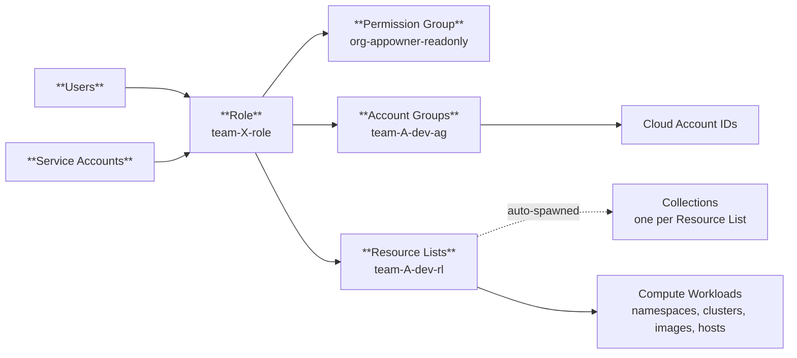

# rbac

Provisions one team's Prisma Cloud RBAC artifacts - Account Group(s), Resource
List(s), a custom Role, an optional Service Account, and an optional CSPM Alert
Rule - and binds them to a shared Permission Group. One module instance per entry
in [`config/teams.yaml`](../../config/teams.yaml).



See [`ARCHITECTURE_DIAGRAM.md`](../../../ARCHITECTURE_DIAGRAM.md) for the full diagram.

For deployment-specific operational procedures (ownership roles, incident playbook,
security risk-acceptance, IdP handoff, tenant prerequisites), see the
[Operations Runbook](../../../.etc/OPERATIONS_RUNBOOK.md).

## Usage

```hcl
module "team_alpha" {
  source = "./modules/rbac"

  providers = { prismacloud = prismacloud }

  team_name             = "team-alpha"
  permission_group_id   = prismacloud_permission_group.app_owner_readonly_singleton.id
  permission_group_name = prismacloud_permission_group.app_owner_readonly_singleton.name

  account_groups = [
    { name = "team-alpha-ag", account_ids = ["111111111111"] },
  ]

  resource_lists = [
    {
      name                 = "team-alpha-rl"
      compute_access_group = { namespaces = ["team-alpha-*"] }
    },
  ]
}
```

In practice the root module fans this out over
[`config/teams.yaml`](../../config/teams.yaml) with `for_each`; see
[`terraform/main.tf`](../../main.tf).

## What the module creates

| Artifact | Purpose |
|---|---|
| Account Group(s) | Scopes the team to specific cloud account IDs (AWS / Azure / GCP), including optional non-onboarded account IDs. 1..N via the `account_groups` input. |
| Resource List(s) (CAG) | Scopes the team to specific Compute workloads (namespaces, clusters, images, hosts, labels). 1..N via the `resource_lists` input. |
| Role | Binds all the team's Account Groups + all Resource Lists + the shared Permission Group. An IdP maps SAML groups to this Role's ID. |
| Auto-Collection(s) | Side effect: Prisma Cloud spawns a read-only Collection named `<resource_list_name> - Access Group (RBAC)` per Resource List. The [`auto_collection_expected_names`](outputs.tf) output gives you the name to look for; [`resource_list_collection_ids`](outputs.tf) resolves each one's ID from the live tenant. |
| Dashboard Collection | A dedicated Terraform-managed Collection (`<team>-collection`) for scoping dashboards/widgets. Distinct from the auto-Collections. Scopes by Account Group only - the `prismacloud_collection` resource does not support workload (CAG) filters. |
| Alert Rule (CSPM) | A CSPM Alert Rule scoped to the team's Account Group(s) + Resource List, firing on high+critical severity by default, with an optional notification target. Compute/CWP findings are not routed here. |
| Service Account (optional) | When `service_account_name` is set, creates a SERVICE_ACCOUNT user profile plus one access key. The key id and secret come back as outputs (the secret is sensitive). |
| Team member assignments (optional) | When `team_members` is set, grants the team Role to each listed existing tenant user, preserving their other roles (union). The module adopts each user's profile into state via an import block. Runs after all other resources. |

The module does not create users. SAML groups are mapped to role IDs in the IdP;
see the [Operations Runbook](../../../.etc/OPERATIONS_RUNBOOK.md) for the handoff contract.

### The auto-spawned Collection (not Terraform's doing)

Every `prismacloud_resource_list` causes Prisma Cloud — server-side, on create —
to spawn a companion Collection named:

```
<resource_list_name> - Access Group (RBAC)
```

Terraform never declares it and never sees it in the plan. It has
`owner = "Prisma Cloud"`, `system = true`, `prisma = true`, and appears only
after the apply. Deleting it is not supported; it is bound to the Resource List.

**The name cannot be changed.** The `- Access Group (RBAC)` suffix is generated
by the platform, so the only lever is `resource_list_name_suffix`, which controls
the prefix. There is no input — here or in the provider — that suppresses or
renames the spawn.

This matters because that suffix contains spaces and parentheses, and the Compute
runtime-policy API only accepts `^[A-Za-z0-9_:-]+$`. So the auto-spawned
Collection is **permanently unusable for runtime policy scoping**, no matter what
the Resource List is called. That constraint is what the opt-in Compute Collection
below exists to work around.

## Compute Collection (opt-in)

A team can end up with **three** collections. They are not interchangeable, and
only one of them can scope a Compute runtime policy:

| Collection | Created by | Visible to Compute? | Usable in a runtime rule? |
|---|---|---|---|
| `<team>-assets` | `prismacloud_collection` (this module) | ❌ No | ❌ No |
| `<rl> - Access Group (RBAC)` | Auto-spawned per Resource List | ✅ Yes | ❌ No — illegal characters |
| `<team>-workloads` | `prismacloudcompute_collection` (opt-in) | ✅ Yes | ✅ **Yes** |

Two independent reasons rule the first two out:

1. **CSPM and Compute keep separate collection stores.** A `prismacloud_collection`
   simply does not exist as far as the Compute console is concerned.
2. **The runtime-policy endpoint only accepts names matching `^[A-Za-z0-9_:-]+$`.**
   The auto-spawned collection *is* visible to Compute, but its name contains
   spaces and parentheses, so the API rejects it with HTTP 400. This applies to
   every RBAC-spawned collection in the tenant, without exception.

So if you want a team's runtime policy scoping, enable the Compute collection:

```yaml
my-team:
  compute_collection:
    enabled: true
    clusters: ["my-cluster"]   # omit for ["*"] (all clusters)
```

That produces `my-team-workloads` — the value to use as `add_collection` in
`config/compute-runtime-policies.yaml`. The name is validated against the
charset rule at **plan** time, so an illegal name fails before anything is
created rather than as an opaque 400 mid-apply.

Unset (the default) creates no Compute collection.

## Shared Permission Group

Declared once in [`terraform/main.tf`](../../main.tf). The grant catalog is
`local.permission_group_features` in [`terraform/locals.tf`](../../locals.tf), which
mirrors the live tenant's `GET authz/v1/permission_group/<id>` response.

There is no override variable - edit the catalog directly and code-review the change.

> Note: the default catalog grants `computeManageDefenders` (READ + UPDATE), which
> Prisma Cloud does not scope by Account Group or Resource List. This is a deliberate
> security trade-off. Review the risk-acceptance and compensating controls in the
> [Operations Runbook](../../../.etc/OPERATIONS_RUNBOOK.md) before enabling it.

## Module inputs

| Variable | Required | Default | Purpose |
|---|---|---|---|
| `team_name` | yes | -- | Lowercase-hyphenated team ID (e.g. `team-alpha`). Prefix for resource names. |
| `team_description` | no | auto | Fallback description applied to any resource without its own override. |
| `role_description` | no | `null` | Description for the Role. `null` falls back to `team_description`; `""` is honored (empty). |
| `alert_rule_description` | no | `null` | Description for the Alert Rule. `null` falls back to `team_description`; `""` is honored (empty). |
| `dashboard_filter_collection_description` | no | `null` | Description for the dashboard Collection. `null` falls back to `team_description`; `""` is honored (empty). |
| `permission_group_id` | yes | -- | ID of the shared PG. |
| `permission_group_name` | yes | -- | Name of the shared PG. Used as the Role's `role_type`. |
| `account_groups` | no | `[]` | List of `{ name, description, account_ids, non_onboarded_account_ids }`. Each entry's `name` defaults to `<team_name><account_group_name_suffix>` when omitted (only sensible for a single entry); >1 entry requires unique names. Per-entry `description` falls back to `team_description` when null; `""` is honored. |
| `resource_lists` | no | `[]` | List of `{ name, description, compute_access_group }`. Each entry's `name` defaults to `<team_name><resource_list_name_suffix>` when omitted (only sensible for a single entry); >1 entry requires unique names. Per-entry `description` falls back to `team_description` when null; `""` is honored. |
| `service_account_name` | no | `null` | When set (with `service_account_role_id`), creates a SERVICE_ACCOUNT + access key. |
| `service_account_role_id` | conditionally | `null` | Required when `service_account_name` is set. Role assigned to the SA (also `default_role_id`). |
| `service_account_time_zone` | no | `America/New_York` | Time zone for the SA profile. |
| `access_key_expiration_days` | no | `90` | Days until the SA access key expires (tenant mandates expiration; platform max 90). Computed once via `time_offset`, no drift. |
| `team_members` | no | `[]` | List of existing tenant user emails to grant the team Role. Preserves their other roles (union). Terraform takes ownership of these user profiles. |
| `account_group_name_suffix` | no | `-account-group` | Override the default Account Group name suffix (used when an entry omits its `name`). |
| `resource_list_name_suffix` | no | `-resource-list` | Override the default Resource List name suffix (used when an entry omits its `name`; also affects auto-Collection name). |
| `role_name_suffix` | no | `-role` | Override the Role's name suffix. |
| `dashboard_collection_name_suffix` | no | `-collection` | Override the dedicated dashboard Collection's name suffix. |
| `alert_rule_name_suffix` | no | `-alert-rule` | Override the Alert Rule's name suffix. |
| `alert_severity_filter` | no | `["high","critical"]` | Severity baseline the Alert Rule fires on. `[]` disables the filter. |
| `alert_scan_all` | no | `true` | Evaluate all policies (subject to severity filter). Ignored when `alert_policies` is non-empty. |
| `alert_policies` | no | `[]` | Explicit policy IDs to evaluate (overrides `scan_all`). |
| `alert_excluded_policies` | no | `[]` | Policy IDs to exclude from the Alert Rule. |
| `alert_notification` | no | `null` | Optional `{ config_type, recipients, frequency }` notification target. The integration must already exist in the tenant. Null = no notification config. |

Full descriptions: [`variables.tf`](variables.tf).

## Module outputs

| Output | Use |
|---|---|
| `team_role_id` + `team_role_name` | IdP handoff for SAML group mapping. |
| `account_group_ids` | Map of Account Group name => ID. |
| `account_group_names` | List of Account Group names. |
| `resource_list_ids` | Map of Resource List name => ID. |
| `resource_list_names` | List of Resource List names. |
| `auto_collection_expected_names` | Map of Resource List name => expected auto-spawned Collection name - verify in UI under Inventory -> Collections. |
| `resource_list_collection_ids` | Map of Resource List name => resolved auto-spawned Collection ID (looked up by name from the live tenant; null when absent). |
| `dashboard_collection_id` + `dashboard_collection_name` | The dedicated dashboard Collection. |
| `alert_rule_id` + `alert_rule_name` | The CSPM Alert Rule. |
| `service_account_username` | Service account username (null if none). |
| `service_account_access_key_id` | Service account Access Key ID (null if none). |
| `service_account_secret_key` | Service account Secret Key (null if none). SENSITIVE - returned once at creation; treat state as a secret. |

## Notes

- The auto-Collection name is a constructed string output, not a data source. This
  avoids two problems: the provider may not ship a `prismacloud_collection` data
  source, and the auto-spawn has a 1-30s eventual-consistency window that would break
  first-apply data reads. If a Collection is missing after apply, the tenant's
  Collections quota (default 200) may be exhausted - raising it is a support request.
- `computeManageDefenders` and `has_defender_permissions` are AND-gated server-side.
  Set both together; toggling one yields a half-working state.
